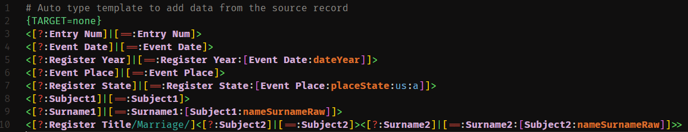
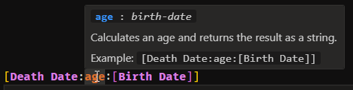

# Online Research Assistant (ORA)

This is an unofficial language extension to facilitate the development of templates to be used with the [Online Research Assistant (ORA)](https://ora-extension.com/) genealogy research tool.

## Features

- Syntax highlighting for ORA templates, allowing formatting of all brackets, operators, field names, transforms and their parameters, and auto type control sequences.
- Hover tooltips provide reference information and examples for all ORA transforms.

## Installation

When released, this extension will be available on the [VS Code Extension Marketplace](https://marketplace.visualstudio.com/items?itemName=trdishat.ora-syntax).

## Usage

### Syntax Highlighting

The syntax of an ORA template saved with the `.ora-template` filename extension will be displayed with highlighting, making it easier to read and understand. As detailed below, the styles can be configured in the standard VS Code settings.



### Hover Preview

Display the full command syntax with parameters, explanation, and example usage for a ORA transform by hovering over it.



## Configuration

There are no native settings for this extension. However, you can customize the style of the ORA syntax highlighting by making color customizations in your VS Code settings file, either at the User or Workspace level. For example, the following settings will make the ORA field names bold, and the ORA transform parameters two different shades of blue, depending on whether you are using a light or dark theme:

```json
"editor.tokenColorCustomizations": {
  "textMateRules": [
    {
      "scope": "variable.ora-template",
      "settings": {
        "fontStyle": "bold"
      }
    }
  ],
  "[*Light*]": {
    "textMateRules": [
      {
        "scope": "string.parameter.ora-template",
        "settings": {
          "foreground": "#1A4F8C"
        }
      }
    ]
  },
  "[*Dark*]": {
    "textMateRules": [
      {
        "scope": "string.parameter.ora-template",
        "settings": {
          "foreground": "#66A0C8"
        }
      }
    ]
  }
}
```

These are the ORA elements that you can customize:

| ORA element scope | Description | Example |
| --- | --- | --- |
| `comment.line.number-sign.ora-template` | Comment line | `# I am a comment` |
| `constant.character.escape.ora-template` | Escape character | `\# I am not a comment` |
| `keyword.operator.ora-template` | Value test or assignment operator | `? ! = < > + -` |
| `keyword.conditional.ora-template` | Conditional expression separators | `< \| >` |
| `variable.ora-template` | Field name | `Source.ID` |
| `support.function.ora-template` | Transform name | `placeCity` |
| `string.parameter.ora-template` | Transform parameter | `birth-date` |
| `string.regexp.ora-template` | Regular expression string | `/\d+/` |
| `string.control.ora-template` | Auto type control sequence | `{TARGET=none}` |

## Contributing

The source code for this extension is hosted on [Github](https://github.com/trdischat/ora-syntax). Contributions, pull requests, suggestions, and bug reports are greatly appreciated. Post any issues or suggestions on the [github issues page](https://github.com/trdischat/ora-syntax/issues). Add the feature request tag to any feature requests or suggestions. To contribute, fork the project and then create a pull request back to master. Please update the README if you make any noticeable feature changes.

## Release Notes

Check the [CHANGELOG.md](https://github.com/trdischat/ora-syntax/blob/master/CHANGELOG.md) for any version changes.

## License

This project is licensed under the MIT License - see the [LICENSE](https://github.com/trdischat/ora-syntax/blob/master/LICENSE.md) file for details.

---
